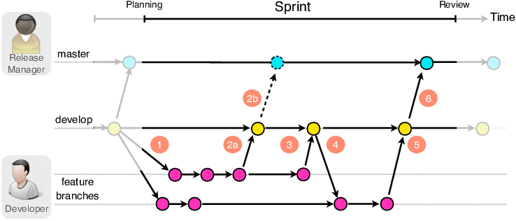
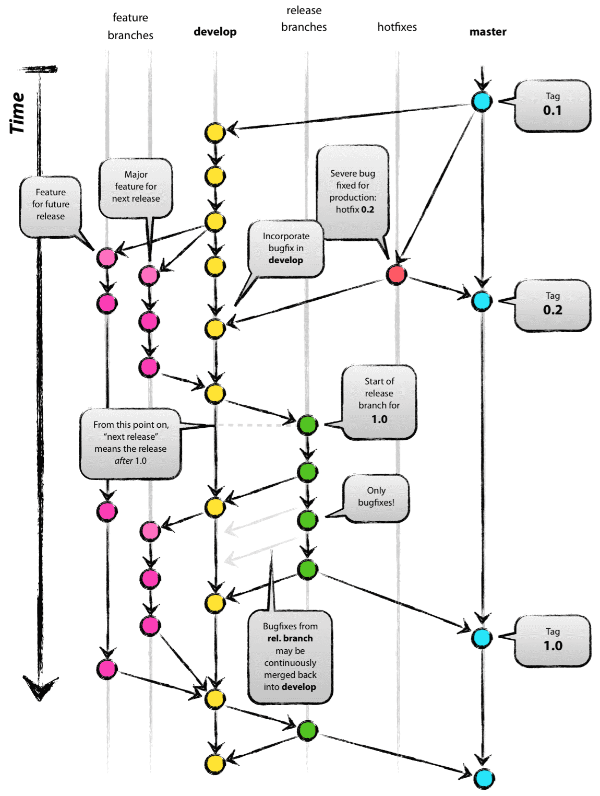

# Github: a complete guide (under construction)


* [Github Basics](#github-basics)
    * [Create a new project in Github](#create-a-new-project-in-github)
    * [Fork and Clone an existing project from Github](#fork-and-clone-an-existing-project-from-github)
    * [Commit and push your changes to Github](#commit-and-push-your-changes-to-github)
    * [How to publish your website in Github.io](#how-to-publish-your-website-in-github.io)
    * [Basic Git Commands](#basic-git-commands)
    * [What is a remote?](#what-is-a-remote)
    * [Adding a remote](#adding-a-remote)
* [Advanced]    
    * [Branches](#branches)
    * [Creating a Pull Request (PR)](#creating-a-pr)
    * [Git in the final projects](#git-in-the-final-projects)

# Github Basics

## Create a new project in Github

See the comlete tutorial on [Github: Create a repo](https://docs.github.com/en/github/getting-started-with-github/create-a-repo)

Instead of cloning the repo that you created in Github, you can also initiallize the repo using the command line/terminal by followint the [Add a project using the command line](https://docs.github.com/en/github/importing-your-projects-to-github/adding-an-existing-project-to-github-using-the-command-line)

## Fork and Clone an existing project from Github

We use fork to copy an existing Github repository into out Github account
We use clone to copy an existing Github repository into our laptop
If we don't fork first, for sure we can clone any repository from others, but if they don't give privileges we will not be able to push the changes, that's why we always fork the repositories

To fork a repo:

Firstly you need to click the "Fork" button:


Then you should be brought to your new fork (notice how the repo title changes):


[Github:Fork a repo](./assets/git/fork-a-repo)

To clone a repo:

Now you can clone from your fork by copying the URL here:


The command to clone is:

```
git clone URL_YOU_JUST_COPIED
```

## Commit and push your changes to Github

Once you have your repository
- `git add .` // track changes on files (create, remove, modify)
- `git commit -m “message”` // save changes
- `git push`  // upload your commits from origin (your laptop) to the remote (Github) in branch master (the default)

## How to publish your website in Github.io

1. Now all that remains is to publish your website! Still under
   `http://github.com/your-username/your-repository-name`, find the settings
   icon in the top right corner.

<div style="text-align: center;">
  
</div>

2. Find the section named "Github Pages" and select "master branch" in source,
    then hit "Save".

<div style="text-align: center;">
  
</div>

3. Wait a few minutes, then refresh the page and come back to the Github Pages
    section. You should see a green bar saying "Your site is published at
    `http://github.com/your-username/your-repository-name`". Click the link,
    verify that your website is there, then share it with your CYF class!


## Remote

Git has a concept of a "remote". These are other git repositories that can be connected to over the internet. You can push or pull code changes from them. Remotes have a *name* and a *URL*. 

All the remotes that you will use at Migracode are hosted on GitHub, so have a github.com URL.

When you clone a repo from GitHub, the default remote is named `origin` and the URL is set to that of the GitHub repo.

You can view the remotes you have set up with:

```
git remote -v
```


## Basic Git commands

If you are working with the terminal, before execute the commands, are you in the right repository folder? We can have different folders, each one for a different repository.

Configuration commands:

- `git config --global user.name "John Doe"`
- `git config --global user.email johndoe@example.com`
- `git config --list`

Commands to create a project:

- `git init *project name*`  //initialize GIT repository in an empty directory (locally)
- `git add .` //track changes on files (create, remove, modify)
- `git commit -m “message”` //save changes
- `git remote add origin *https://github.com/yourusername/yourrepo*`
- `git push -u origin master` //upload origin (my laptop) to the server in branch 
- `git status` //show current status
- `git clone *url*` //download files from URL with a file .git


# Advanced


# Git Branching and merging

## Git Branching

You have been using git to track the changes you make to your exercises project. Each time you commit, you save a copy of your files.


When you create a new branch, you create a separate line of commits.


With branches, you can work on two copies of your project and switch back and forth.


Complete exercise 9 from the [exercise project](https://github.com/Migracode-Barcelona/html-css-git-exercises) to learn how to use git branches.

> If you want to go deeper, read this article on [how git branching works](https://www.atlassian.com/git/tutorials/using-branches).


## Git Merging

Last week you used Git to create a branch so that you could work on two different copies of your project at the same time.


This week you will learn how to merge your changes in one branch back to your master branch.


Complete exercise 18 from the [exercise project](https://github.com/Migracode-Barcelona/html-css-git-exercises).

## Git Merge Conflicts

Last week you used Git to merge your changes from one branch back into your master branch.


Sometimes Git can not automatically merge one branch into another, because each branch has modified the same line of code. Git does not know which version of the line is the correct one. When this happens, we have a "merge conflict".


As a developer, you have to tell Git which version of the line of code is correct.

Complete exercise 28 from week 3 of the [HTML, CSS and Git Exercises](https://github.com/Migracode-Barcelona/html-css-git-exercises) to learn how to resolve a merge conflict.


https://www.atlassian.com/git/tutorials/using-branches/merge-conflicts


## Git Conflicts

As a professional, you'll usually need to work alongside other coders to build an app or website. We use version control to coordinate changes and manage any conflicts that arise. [Git](https://git-scm.com/) is a version control system which helps us merge code that we've been working on separately into one common codebase.

To manage conflicts, we will need a common code base in which all changes are coordinated. When working on our own, we'll make our changes in `branches` to keep the code separate. Then we'll learn how to refresh your individual `branch` with the common code base, and prepare your changes to be merged.

> Exercise: Get together in pairs and select a "leader". The leader should fork [this repository](https://github.com/CodeYourFuture/first-git-conflict) to their GitHub account. The other person should then fork the leader's repository. Both students should then clone their own personal forks locally.

Now that you have the project set up on your computer, you need a place to safely make changes without effecting the common code base. To do this, we'll navigate to our project in the Terminal and create a new branch:

```bash
cd <your-project-directory>
git checkout -b my-first-branch
```

When you commit changes on this branch, your changes will be saved separately from the common code base. This way both team members can make changes at the same time.

> Exercise: Add your name and a sentence about yourself to the `index.html` file. Then `git add` and `git commit` to commit to your personal branch.

Now you have two branches: `master` and `my-first-branch`. These branches have _diverged_, which means you have changes in one that don't appear in the other. You can check this by running `git checkout master`, then looking at your `index.html` file.

When you're done, run `git checkout my-first-branch` to go back to the branch with your changes. Git saves your changes in both branches and lets you switch between them. That's why we call it "version control". It saves different versions so you can switch between them.

Right now, your new branch only exists on your computer. Let's push it up to GitHub so you can see it in your profile.

```bash
git checkout my-first-branch
git push -u origin my-first-branch
```

Now both students in each pair, the "leader" and the other student, should have branches with changes. Now let's try to merge these changes together into the "leader's" master branch.

> Exercise: Browse to the "leader's" GitHub repository and open a new Pull Request. The Pull Request should ask to merge your `my-first-branch` branch into the "leader's" `master` branch. Ask a mentor for help if you have trouble figuring out how to issue a Pull Request. When both students have issued a Pull Request to the correct place, merge _one_ of them but not the other.

Congrats, you've merged one student's changes with the common code base in the `master` branch. If you check the other Pull Request, you'll see you have a problem. It can't be merged automatically because there's a conflict. Why?

Conflicts emerge whenever the same file has been edited, and git can't determine what changes should be kept and what changes should be discarded. A human -- that's you -- needs to step in and sort it out. To help us, git writes into our code so we can see where it is confused. Here's an example of a merge conflict in our code:

```diff
<<<<<<<  HEAD
+   <h2>Mozafar</h2>
+   <p>I am a mentor at CodeYourFuture.</p>
=======
-   <h2>Daniel</h2>
-   <p>I like to ride bikes</p>
>>>>>>> my-first-branch
```

To resolve a conflict, we decide which lines to keep and which lines to remove. When we're done, we remove the extra lines that git added (`<<<<< HEAD`, `========` and `>>>>>>>`).

Let's see how we can resolve this conflict with your branches. First we need to fetch the latest changes from the leader's `master` branch. If you're the **leader**, just do:

```sh
git checkout master
git pull
```

If you're the **other student**, you need to set up the remote and pull from that master:

```sh
git checkout master
git remote add upstream <your-leaders-git-repository-url>
git pull upstream master
```

Now everyone's `master` branch should include the Pull Request that was merged. Whichever student still needs to get their Pull Request merged can bring those changes into their branch like this:

```sh
git checkout my-first-branch
git merge master
```

You probably received a **merge conflict**.

> Exercise: Follow the steps we discussed before about how to resolve a merge conflict by editing the file. Make sure both students changes are included in the final version. When you're done, use `git add`, `git commit` and `git push` to share your changes with GitHub. If everything has gone correctly, you can now merge the Pull Request.

Now everyone can sync their changes. If you're the **leader**, just do:

```sh
git checkout master
git pull
```

If you're the **other student**, do this:

```sh
git checkout master
git pull upstream master
```

> Exercise: As a group, discuss why the `git pull` command is different for the **leader** and the **other student**.

> Exercise: Try to do the pull requests again, but this time switch the pull requests so that the other student must manage the merge conflict.

If you're feeling confused, don't worry. Version control is one of the most difficult things you'll learn and we'll be going over it again and again and again.


## Merging and advanced Git commands

- `git fetch` //fetch latest changes from origin and all branches (no merge)
- `git pull`  //fetch latest changes from origin and all branches (with merge)
- `git merge`

Branches:

- `git branch test` //creates a new local branch
- `git checkout test` //move to branch test
- `git checkout master` //move to branch master
- `git checkout -b test` //create a new local branch and move into it
- `git push origin test` //push the branch and all commits to the server
- `git branch -d test` //remove a local branch
- `git checkout -b test origin/test`
- `git fetch --all`   //to get all branches from server


# Making a Pull Request


## Adding a Remote

Follow these instructions if you are getting an permission error when pushing your changes. If you have cloned the original repo *before* forking, you'll need to follow these instructions. You can check this by running `git remote -v`. If the output looks something like:

```
origin git@github.com:CodeYourFuture/css-skin.git (fetch)
origin git@github.com:CodeYourFuture/css-skin.git (push)
```

then you have cloned before forking. The key is that the `origin` remote is pointing to a CodeYourFuture URL. Don't worry, we can fix it!

The first step is to fork the original repo. Follow the first 2 steps from [forking instructions](#how-to-fork-a-github-repo) above.

Now, instead of cloning the fork (you have already cloned), you need to add it as a remote.

Run:

```
git remote add fork URL_YOU_COPIED_FROM_FORK
```

This will add a new remote called `fork` that points to your new fork. To check this, run `git remote -v` again. You should see both the `origin` and `fork` remotes.

Now that you have your `fork` remote you can push to it (instead of the `origin` remote, which will error) by running:

```
git push fork
```

You'll need to remember to add the `fork` *every time you push*.

## Creating a PR

So you've done your homework, you've committed your changes and are ready to make a PR. Congrats! 🎉🎉🎉

At this point you should have followed the instructions either to [fork the original repo](#how-to-fork-a-github-repo) or [added a remote to your fork](#adding-a-remote). If you haven't make sure you read those sections first.

You will need to push to your fork. If you forked and then cloned (as in the [how to fork instructions](#how-to-fork-a-github-repo)) then you just need to run `git push`. If you [added a remote to your fork](#adding-a-remote), then you will need to run `git push fork`.

Next you need to go the original repo in your browser (probably starting with https://github.com/CodeYourFuture). Next click the Pull Requests tab:


Then click the New pull request button:


Then click the "compare across forks" link:


Then click the "head fork" dropdown button:


Then find your fork in the list and click it:


Then click the Create pull request button:


Almost there! Now fill out the PR form. Give it a sensible title and an (optional) description:


And finally click the Create pull request button at the bottom of the form:


That's it! You created your PR!


[Creating a pull request from a fork](https://help.github.com/articles/creating-a-pull-request-from-a-fork/)

## Git in the final projects

In the final projects you will have to manage a Git repository to work all the Team toghether, there are many ways to do it, but these are our recommendations:

- **Separate front-end and back-end code:** Create one repository for the back-end code and another one for the front-end code, or in the same repository create a folder for the back-end and a different folder for the front-end, but take into account to manage the folders and package.json properly without breaking others work
- **One Team, One Repo:** Create the repositories in the account of one member of the team, and grant the others students to work there. The other members should clone directly the repository, DO NOT FORK IT! if you fork it every member of the team will work in an independent reposotory adding difficulties to manage merges of work
    - To give push privileges to other team members, go to your repository in GitHub,  and click Settings->Manage access -> Invite a collaborator
- **Use a Git strategy:** once you divide your work in different functionalities and are assigned to team members, to reduce the number of merges and do not involve everybody in the common files, you should have a strategy to work
- **Assign a Git Release Manager:** Assign a member of the team that knows all the code structure and will be the best member to join all functionalities together. The Migracode Team and mentors will help this member to solve conflicts and manage the versions of the project.
- **Use gitignore:** Check this [link](https://www.atlassian.com/git/tutorials/saving-changes/gitignore)


### Small Teams Git strategy

There are strategies with more branches and more structurated, like the common strategy in companies, but taking into account number of people, the criticallity of our software and to not spend many hours merging. We recommend you this strategy for the final project!

- 3 type of branches: _master_, _develop_ and _developers_ branches
- 2 user roles: _Release Manager_ and _Developer_



**Branches:**

-	**_master_**: The master branch stores the official release history, the versions that we will show to the client or to the class after each sprint.
-	**_develop_**: The develop branch serves as an integration branch for features. Once develop has acquired enough features for a release, those will be tested before merge it with master.
-	**_developer_ branches**: Each new developer has a branch with their name, as _dev-john_ or _john_. _developer_ branches are created from _develop_ and the developer will always work there.

**Roles:**

-	**Release Manager**: is the one that manages _master_ and _develop_. This user, that at the same time is a Developer, do all merges between developers branches and _develop_. Also is the one that creates versions in _master_.
-	**Developer**: all the members on the team are developeres, they develop the assigned features in the branch.

### Actions and commands

#### First steps:

**Create the repositories (Release Manager):**

- Create and add write and push privileges to all developers
- Create a new branch develop from master:
    -	`git checkout master` be sure you are on master branch
    -	`git checkout -b develop` Create the branch _develop_ from _master_
    -	`git push -u origin develop` Push the local branch to remote, so it is published on Github and other members can see it
- Create a new branch for each developer from develop:
    - `git checkout -b dev_john`
    - `git push -u origin develop`

**Move to working repositories (all developers):**

- Each developer should get the new branches from remote and move to the assigned branch:
    - `git fetch --all` Get all new branches created
    - `git checkout dev_john` Move yo your name branch

#### Daily work:

- All developers should commit and push all your work
    - `git add .`
    - `git commit -m "new feature"`
    - `git push`

#### End of a sprint:

**Create the sprint version (Release Manager):**

- `git checkout develop`
- `git fetch --all`
- Merge develop branch with the branch of each developer
    - `git merge dev_john`
    - `git add .`
    - `git commit -m "merge with john"`
    - `git push`
- Check that all functionalities are working together, have a meeting to check the version and fix all integration or merge problems
- As a closed version, move the code to _master_:
    - `git checkout master`
    - `git merge develop`
    - `git add .`
    - `git commit -m "merge with john"`
    - `git push`
- Go back to your working branch
    - `git checkout dev_me`

**Update your working branches with last version (all developers)**

- `git fetch --all` to get last version of all branches
- `git merge develop`
- `git add .`
- `git commit -m "merge with develop"`
- `git push`

### Main companies Git strategy

Here you can find an example on how to manage planified and unplanified (with bugs) versions of a software. [More information](https://nvie.com/posts/a-successful-git-branching-model/)



-	**_master_**: The master branch stores the official release history, for each published version a tag is assigned with a version number
-	**_hotfix_**: is the branch we use to fix bugs from the published version as soon as possible, without adding new features. As we can see in v0.1 version the software has a bug, we fix it in the Hotfix branch, and then we merge it directly with master. Also this change is added to develop brach for future versions.
-	**_release-xxx_**: release branches are created from develop, to have a version that should be tested in detail to become  a new version, if during the test some bugs are found are fix directly in this branch. xxx is the name o the release
-	**_develop_**: The develop branch serves as an integration branch for features. Once develop has acquired enough features for a release, a new release branch is created to test it before go to master.
-	**_feature-xxx_**: Each new feature with name xxx, should reside in its own branch. But, instead of branching off of master, feature branches use develop as their parent branch. When a feature is complete, it gets merged back into develop. Features should never interact directly with master.
