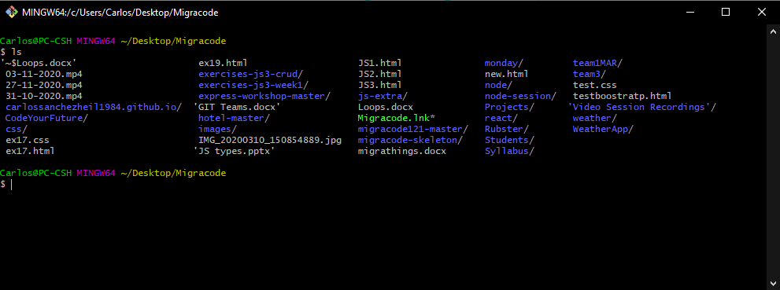

# Lesson 0

**What we will learn today**

* [MigraCode](#migracode)
* [Operating Systems](#operating_systems)
* [The Command Line](#the_command_line)
* [Visual Studio Code](#visual-studio-code)
* [Git](#git)

---

## MigraCode

* Who we are
* What we teach
  * Read this Technology Survey from
    [StackOverflow 2019](https://insights.stackoverflow.com/survey/2019). Pay
    particular attention to the technologies we'll be teaching you (JavaScript,
    React, NodeJS) and the evolution in the last years
* [House Rules](house-rules.md)
  * How we work
  * How we treat each other

Welcome to MigraCode and to the world of Web Development!!!

## Operating Systems

An Operating System (OS) is a powerful, and usually large, program that controls and manages the hardware and software on a computer. All computers and computer-like devices require operating systems, including laptops, tablets, desktops, and smartphones. The OS performs all the basic tasks like file management, memory management, process management, handling input and output, and controlling peripheral devices such as disk drives and printers.

The most common operating systems for desktop and laptop computers are:
- Microsoft Windows (Windows 95, Windows 7, Windows 10,...)
- Linux (Debian, Red Hat, Ubuntu,..)
- macOS
- Chrome OS
- Android and iOS are operating systems for mobile devices.

### Unix

Unix is ​​a family of operating systems. The first version was developed starting in 1969. Unix is ​​characterized by being portable and multitasking.

Unix operating systems are widely used in a multitude of devices that range from the most capable supercomputers to the mobile phones and computers that we use daily. The philosophy of Unix systems is characterized by:

- a hierarchical file system,
- a large collection of small programs that can work in series,
- the use of text files to store the data,
- treating devices as files.

Linux and MacOS are examples of Unix systems.

### Linux

Linux is a family of Unix-like operating systems that use the Linux kernel.
The name comes from the original programmer, a student named Linus Torvals, who in 1991, working with the GNU project of the Free Software Foundation, created the first version of this operating system.

Linux development is one of the clearest examples of free, open source software development by a diverse community of programmers all over the world. Anyone can use the operating system, study it and modify it. The open source nature of Linux is protected by the GPL (GNU General Public License).

### Ubuntu

Ubuntu is a Linux distribution. It is an open-source operating system aimed at desktop users, and its strengths are that it is easy to use and install. Although the desktop is somewhat different from Windows or Mac OS, a user who is accustomed to any of these operating systems will not have many problems becoming familiar with Ubuntu.
Ubuntu is based on a maintained distribution by a community called Debian. Debian's main goal is to create a robust operating system that includes the largest possible proportion of free programs.

If you are using [Ubuntu](https://ubuntu.com/), you will see this sreen:

<div style="text-align: center;">
  
</div>

Demo of Ubuntu:
- The friendly Desktop
- The filesystem: navigate through folders and files using File Manager
- Ubuntu software: a tool to install software easily

## The Command Line

The **Command Line**, also knows as **Bash**, **Terminal** or **Shell** (**Línea de Comandos** ó **Símbolo de sistema** in Spanish) is a way of controlling a computer, based on a text interface. 


Why should I use the command line/terminal?

* Once you know the basics, it helps you to interact with you computer faster
* Some software for developers must always be used from a terminal
* You have more control over the software
* It allows you to create scripts (lists of commands) and automate manual tasks
* It is what hackers use in movies.

### How do I use the terminal on my computer?

Here are the instructions for the three operating system: 

- MacOS: You can find the Terminal.app in your Applications, in the folder Utilities. An alternative way to open the Terminal is to search with Spotlight and type in “terminal”. Select the application called terminal and press the return key. This should open up an app with a black background. When you see your username followed by a dollar sign, you’re ready to start using the command line.
- Linux: You can open the Terminal by directly pressing [ctrl+alt+T] or you can search for it by clicking the dash (#) icon, typing in “terminal” in the search box, and opening the Terminal application. This should open up an app with a black background. When you see your username followed by a dollar sign, you’re ready to start using the command line.
- Windows: Windows has its own **Command Prompt**. It is very similar to the Unix command line, but some commands are not exactly the same. For the main differences go to this [link](https://enexdi.sciencesconf.org/data/pages/windows_vs_mac_commands_1.pdf). Because of these differences, and because we want to learn UNIX commands, we use the **Git Bash**. Go to the Windows "Start" button and search the program **Git Bash**. When you open it you will see a screen like this one:



After you have followed the instructions, open a terminal and write `ls`, then press the `Enter` key. What do you see?

### Commonly used commands

These are the most used commands that you will quickly become comfortable with during the course. These commands allow you to effectively move around the filesystem and write software on your laptop. There are more commands in the tables with more commands and descriptions below.

* `cd` - change directory. To move up one folder level and into the parent directory use: `cd ..`
* `ls` - list the contents of a directory. Can also be used as `ls [directory_name]` to list the contents of a specific directory without actually moving (with `cd`) to it
* `pwd` - print working directory: print the full location of the folder you are working in
* `mkdir [name]` - make directory: create a new directory, with the given `name` after a space
* `touch [file_name]` - create a new file, with the given name (don't forget to add the extension, like `.css` or `.html`)
* `rm [file_name]` - remove a file
* `rm -r [directory_name]` - remove a directory (**and all files inside that directory**)


#### Getting Help

When you're stuck and need help with a command, help is usually only a few keystrokes away. Help on most commands is built right into the commands themselves, available through online help programs (such as <https://linux.die.net/man>), and of course online.

**Using a command's built-in help**  
Many (but not all) commands have simple help screens that can be called with special command flags. These flags usually look like `-h` or `--help`. Example: `grep --help`.

**Online manuals: the man pages**  
The best source of information for most commands are the manual pages, also known as the man pages. To read a command's man page, type `man` plus a space and the command.  

Example | Info
--------|-------
`man ls` | Get help on the ls command
`man man` | Get the manual for info on the manual!


### More commands

#### Commands for Navigating the filesystem

The first thing you need to do when learning about the filesystem is to take some time to look around. These next few commands will: 
1. Tell you where you are, 
1. take you somewhere else, and 
1. show you what's there. 

The following table describes the basic operation of the pwd, cd, and ls commands, and compares them to certain DOS commands in case you are already familiar with those (if you do not know any DOS commands, just ignore that part of the table).

Command | DOS command | Description
--------|-------------|------------
`pwd` | `cd` | print working directory: shows current location
`cd` | `cd`, `chdir` | change directory; returns to the home directory
`cd directory` | `cd directory` | change into the specified directory
`cd ~` |  | ~ means home directory; shortcut to the home directory
`cd ..` | `cd ..` | move up one directory
`cd -` |  | returns to the directory of your previous location
`ls` | `dir /w` | list all files in current directory
`ls directory` | `dir directory` | list all files in the specified directory
`ls -l` | `dir` | list all files in long format: one file per line, with info about the file
`ls -a` | `dir /a` | list all files, including hidden files (= filenames that start with .)
`ls -ld directory` |  | show detailed information about the directory
`ls /usr/bin/d*` | `dir d*.*` | list all files starting with d in the `/usr/bin` directory


#### Working With Files and Directories

These commands can be used to find information about files, display files, and to manipulate files in other ways for example, copy, move, or delete.

Command | DOS command | Description
--------|-------------|------------
`file` |  | show what kind of file it is (e.g. directory, text, executable file)
`cat` | `type` | display the contents of a text file on the screen
`head` |  | display the first few lines of a text file on the screen
`tail` |  | display the last few lines of a text file on the screen
`tail -f` | `cd ..` | display last lines of a text file and add new data as file grows
`cp` | `copy` | copy a file from one location to another
`mv` | `rename`, `ren`, `move` | moves a file to a new location, or renames a file
`rm` | `del` | remove (= delete) a file
`mkdir` | `md` | create a new directory
`rmdir` | `rd`, `rmdir` | remove a directory


#### Finding things

`ls` is good for finding files if you already know approximately where they are, but sometimes you need more powerful tools. The following commands are used to find files:


Command | Description
--------|-------
`which` | return the full path of where a shell command is located
`whereis` | locate program/source code/manual page for a command (if available)
`locate` | search quickly for files anywhere in the filesystem
`find` | search for files matching specific patterns and advanced search

#### Other Utilities

Here are some other commands that are useful to know:

Command | Description
--------|-------
`clear` | clear the screen
`echo` | display text on the screen, for example write shell scripts
`more` | display file or program output, one page at a time
`less` | like `more` but scrolls backwards as well as forwards
`grep` | search for a pattern in a file or program output
`lpr` | print file or program output
`sort` | sort a file or program output
`su` | switch user: temporarily switch to other account (default is root/superuser)
`su -` | switch to root and log in with root's environment
`su username` | switch to account with name 'username'

#### Command Syntax and using flags

Commands can be run by themselves or you can pass in additional arguments to make them do different things. For this, you us flags. Flags are a way to set options and the commands you run will change their behavior based on what flags are set. You should read the documentation of each command to know what flags are available.
Think of flags as accessories. You have your basic command like rm (remove) that deletes a file. If you add -r (stands for recursive), the command rm -r deletes a folder plus all subfolders and files inside them. If you add -f (stands for force), the command rm -f removes everything you ask. 

**Syntax** `command [-argument] [-argument] [--argument] (filename)`  

Example | Flags
--------|-------
`ls` | List all files in current directory
`ls -l` | List files in long format
`ls -l --color` | As above, with colorized output
`cat filename` | Show contents of a file
`cat -n filename` | Show contents of a file, with line numbers


Some very useful tips to **save yourself some typing**:

- **Autocomplete:** when you are writing the first characters of the name of an existing command or folder, press TAB to automplete
- **History:** press the up or down arrow buttons to see the last commands you executed; you can click on the one you want to use again

### Exercises

**Exercise T-1:** Open a terminal and create the following folder structure:

* terminal-exercises-1
  * src
    * css
    * html

To see what we have created, we first move into the folder /terminal-exercises-1 and then run ls with R option `ls -R`     

**Exercise T-2:** add files to the css and html folders. The final structure should be:  

* terminal-exercises-1
  * src
    * css
      * file1.css
    * html
      * file2.html

**Exercise T-3:** go to the folder /terminal-exercises-1 and create a file with the name index.html. After creating it, move it to the folder /html.  
The final structure should be:

* terminal-exercises-1
  * src
    * css
      * file1.css
    * html
      * file2.html
      * index.html

### Videos and tutorials

Watch, read and practice with these videos and tutorials:

* [Tutorial: Terminal for Beginners!](https://medium.com/@grace.m.nolan/terminal-for-beginners-e492ba10902a)
* [Basic commands tutorial 10 mins](https://youtu.be/vhZLTp6N4XA)
* [Intro to Ubuntu and useful command tutorial 45 mins](https://youtu.be/KSh9-6FIu1w)

## Development Tools

### Visual Studio Code

Visual Studio Code or VS Code is an IDE. IDE stands for Integrated Development Environment. It is the software that you will be using to write most of your code.  It is designed to help you develop your apps quickly, focusing on the problems that you need to solve instead of having to search online for minor details.

#### Auto-complete

One of the most important features of an IDE is that it provides *auto-completion*. This means that it will give you suggestions of what you can write next, while you are typing something.

For example, when writing a CSS property, VSC will tell you what values you can assign to this property.

<div style="text-align: center;">
  
</div>

#### File tree view

The reason why we call an IDE *integrated* is that you almost don't need to leave the window when you are write your code. For example, creating, renaming and moving files can be done directly from the IDE. This functionality can be achieved from something called a **tree view**. You can find this view on the left side of your IDE.

<div style="text-align: center;">
  
</div>

#### Finding files

When working with big projects, you will often need to find a file quickly, without having to go through the tree view manually.

<div style="text-align: center;">
  
</div>

#### Enable formatting on save
To automatically give your code the right format:

* In Visual Studio open the settings file (see [https://code.visualstudio.com/docs/getstarted/settings#_creating-user-and-workspace-settings](https://code.visualstudio.com/docs/getstarted/settings#_creating-user-and-workspace-settings))
* Search for `editor format`
* Set `editor.formatOnSave` and `editor.formatOnPaste` to `true`


## Git

We will use Git as our Version Control System (also known as Source Control). Simply put, a version control system takes snapshots of your files and saves them.

> **What is "version control"?** Version control is a system that records
> changes to a file or set of files over time so that you can recall specific
> versions later.  
> It allows you to revert files back to a previous state, revert the entire
> project back to a previous state, compare changes over time, see who last
> modified something that might be causing a problem, who introduced an issue
> and when, and more. Using a VCS also generally means that if you screw things
> up or lose files, you can easily recover. In addition, you get all this for
> very little overhead.

(Extract from [Git Pro book](https://git-scm.com/book/en/v2/Getting-Started-About-Version-Control) )

This [answer](http://stackoverflow.com/a/1408464) on StackOverflow by [si618](http://stackoverflow.com/users/44540/si618) explains very well why we use version control.

So what is **Git**? Git is one of many Version Control Systems available, and by far [the most popular](http://stackoverflow.com/insights/survey/2015#tech-sourcecontrol).

Do not confuse Git with **Github**! Github is a very popular website where you can publish and share your code. You upload your code as Git repositories (a type of folder or directory), so that you can share it. This makes it possible to collaborate with other people: everyone is writing code that tracked by Git and is added to the same repository.

<div style="text-align: center;">
  
</div>

During our course, we will be using [Github](https://github.com) to store our code. Github is the most popular Git service around, and is used by many large
companies, like Facebook, Airbnb and The Guardian.

[MigraCode's Github page >](https://github.com/migracode-barcelona)


### Get Started

If Git is not installed, follow this tutorial from Github to [setup Git](https://docs.github.com/en/github/getting-started-with-github/set-up-git#setting-up-git)

Once Git is installed, set your username and email adress: `git config --global user.name <name>` and `git config --global user.email <email>`. Example:  
```sh
git config --global user.name "Mona Lisa"
git config --global user.email "email@example.com"
```

#### A typical workflow

* If you want to use the code from another project, the first step is typically to **fork** the project's repo. This means that you create an exact copy (fork) in your GitHub account. NB: the project code is only in your GitHub account, not on your local computer. To download the code to your own computer, you have to **clone** the repository. Read this guide for instructions (https://help.github.com/articles/fork-a-repo/)

* If you're starting a new project then you should follow these steps
  https://help.github.com/articles/adding-an-existing-project-to-github-using-the-command-line/


#### Git in the Terminal: most used commands

* `git init` to be used only **_if it is a new project_**, i.e. a project not **cloned** from a repo or a fork
* `git add .` to add local files to the **index**
* `git commit -m "Good explanation of your file changes"` to commit files to the
  local repo
* `git remote add origin GitRepoRemoteUrl` to be used only **_if it is a new project_** - this sets up the remote url (GitHub)
* `git remote -v` to verify that the remote url is set correctly
* `git push -u origin master` to push your commits to the remote url (Github in our case)

The commands `git add .` and `git commit -m "Good explanation of your file changes"` are used to index and save the files in our computer repository, and we will use `git push` to send the changes to Github. This is confusing when you read it the first time, so let's draw the flow:

<div style="text-align: center;">
  
</div>


Find a complete [Migracode Github Guide](#git.md)

#### More Resources

* [Git Cheat Sheet](https://davidgv.com/wp-content/uploads/2018/08/git-cheat-sheet.png)
* [How does Github work? (30min)](https://www.youtube.com/watch?v=E8TXME3bzNs)
* Follow this tutorial to learn the basic Git commands
  https://www.codeschool.com/courses/try-git
* Another good resource: Git - the simple guide
  http://rogerdudler.github.io/git-guide/
* A more detailed tutorial that goes into advanced topics of Git -
  https://www.atlassian.com/git/tutorials/what-is-version-control
* You can also check this visual explanation of different commands and what they
  do: http://ndpsoftware.com/git-cheatsheet.html#loc=workspace
* This Glossary has definitions of the terms normally used with Git:
  https://help.github.com/articles/github-glossary/


## Your first Migracode GitHub project

Before you started this bootcamp, you have built a website in CodePen and learned the basics of HTML and CSS. Now it's time to learn about the tools that web developers use in their everyday job. These tools will be used during the course, so it is important that you become familiar with them and use them every day.

In order to get started, we would like you to try to complete this task: **move your CodePen website to a web address under
`https://your-username.github.io/your-site-name`** where your-site-name is replaced by whatever you have called your CodePen website.

In the process, you will learn how to store your code outside CodePen's website, in a location where other developers can make changes to it and where you can view a history of all the updates that you have made. Remember: it's ok if you get stuck and don't know how to continue. When that happens, please ask for help. We will cover these steps again in the lesson, and will explain them in more detail.

### How to move your code to Github

1. Export your website as a zip file from CodePen. [Help >](https://blog.codepen.io/documentation/features/exporting-pens/)
2. Extract the contents of the zip file to a folder on your computer. **Make a note** of the location of this folder.
3. Upload the contents of this folder to a Github repository. To do this, you first need to create a new repository in your account on GitHub that has exactly the same name as the folder of the website on your computer. To upload the code from your computer into your GitHub repository: make sure you are in the directory where you have your website code (use `cd` to get into that directory). Then use the `git add .`, `git commit -m "Your message"` and `git push` commands as explained.
4. You should now have a repository with your code in your GitHub account: `http://github.com/your-username/your-repository-name`. Here you can see your code, and there should be an overview of your files, including an `index.html` file.

### How to publish your website in Github.io with GitHub Pages

1. Now all that remains is to publish your website! In your repository `http://github.com/your-username/your-repository-name`, you can find the settings icon in the top right corner:

<div style="text-align: center;">
  
</div>

2. Find the section named Github Pages and select "master branch" under 'Source', then hit "Save".

<div style="text-align: center;">
  
</div>

3. Wait a few minutes, then refresh the page and come back to the Github Pages section. Now you should see a green bar saying "Your site is published at
    `http://github.com/your-username/your-repository-name`". Click the link, verify that your website is there, then share it with your class!


## Homework

* If you have not yet moved your website from CodePen to Github, do it now.
  Please use the information in this section to complete it.
* When your website is live at `https://your-username.github.io/your-site-name`,
  please send a link to the Slack channel of your class.
* Practice how to navigate your computer using a Terminal (view files, copy files).
* Open your website with VS Code and add something to it: text, images, or update the
  CSS. Commit your changes to Github and verify that
  `https://your-username.github.io/your-site-name` has been updated.
* Add, commit and push your changes to Github and check that the changes are applied in the published version.

It's alright if you get stuck or if something doesn't look right! When
that happens, please ask your teachers or classmates for help in Slack, or use the **#support-technical** channel.
