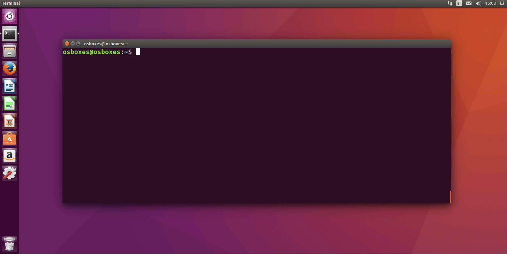

# Lesson 0

**What we will learn today?**

* [MigraCode](#migracode)
* [Operating Systems](#operating_systems)
* [The Command Line or Terminal](#the_command_line_or_terminal)
* [Visual Studio Code](#visual-studio-code)
* [Git](#git)

---

## MigraCode

* Who we are?
* What we learn?
  * Read this Technology Survey from
    [StackOverflow 2019](https://insights.stackoverflow.com/survey/2019). Pay
    particular attention to the technologies we'll be teaching you (JavaScript,
    React, NodeJS) and the evolution in the last years
* [House Rules](house-rules.md)
  * How we work?
  * How we treat each other?

Welcome to MigraCode and to the world of Web Development!!!

## Operating Systems

An Operating System (OS) is a powerful, and usually large, program that controls and manages the hardware and software on a computer. All computers and computer-like devices require operating systems, including laptops, tablets, desktops, and smartphones. The OS performs all the basic tasks like file management, memory management, process management, handling input and output, and controlling peripheral devices such as disk drives and printers.

Most common operating systems for desktop and laptop computers are:
- Microsoft Windows (Windows 95, Windows 7, Windows 10,...), 
- Linux (Debian, Red Hat, Ubuntu,..)
- macOS
- Chrome OS
- Android and iOS are operating systems for mobile devices.

### Unix

Unix is ​​a family of operating systems. The first version was developed from 1969. Unix is ​​characterized by being portable and multitasking.

Nowadays, Unix operating systems are widely used in a multitude of devices that range from the most capable supercomputers to the most popular mobile phones, through the computers that we use daily at our desks. The philosophy of Unix systems is characterized by:

- a hierarchical file system,
- a large collection of small programs that can work in series,
- the use of text files to store the data,
- treating devices as files.

Linux and MacOS are examples of Unix systems.

### Linux

Linux is a family of Unix-like operating systems that use the Linux kernel.
The name comes from the original programmer, a student named Linus Torvals, who in 1991, completing the GNU tools developed by the GNU project of the Free Software Foundation, created the first version of this operating system.

Linux development is one of the clearest examples of free, open source software development by a diverse community of programmers all over the world. Anyone can use the operating system, study it and modify it. The open source nature of Linux is protected by the GPL (GNU General Public License).

### Ubuntu

Ubuntu is a Linux distribution. It is aimed at desktop users and its strengths are its ease of use and installation. Although the desktop is somewhat different from Windows or Mac OS, a user who is accustomed to any of the other operating systems will not have many problems becoming familiar with Ubuntu.
Ubuntu is based on a maintained distribution by a community called Debian. Debian's main goal is to create a robust operating system that includes the largest possible proportion of free programs.

If you are the ones that are using [Ubuntu](https://ubuntu.com/), an open-source operating system, you will see this sreen:

<div style="text-align: center;">
  
</div>

Demo of Ubuntu:
- The fiendly Desktop
- The filesystem: we can navigate through folders and files using File Manager
- Ubuntu software: a tool to install software easily

## The Command Line or Terminal

The **Command Line**, also knows as **Bash**, **Terminal** or **Shell** (**Línea de Comandos** ó **Símbolo de sistema** in Spanish) is a way of controlling a computer based on a text interface. 

<div style="text-align: center;">
  
</div>

It will help you to interact with you computer faster, by helping you to:

* Create and delete files.
* Install web development tools.
* Start a server.

### How do I use it on my computer?

So now that you know what the terminal can do for you, how do you use it? Please
find instructions for your operating system below. 

- MacOS: You can find the Terminal.app in your Applications, in the folder Utilities. An alternative way to open the Terminal is to search with Spotlight and type in “terminal”. Select the application called terminal and press the return key. This should open up an app with a black background. When you see your username followed by a dollar sign, you’re ready to start using the command line.
- Linux: You can open Terminal by directly pressing [ctrl+alt+T] or you can search it up by clicking the “Dash” icon, typing in “terminal” in the search box, and opening the Terminal application. Again, this should open up an app with a black background. When you see your username followed by a dollar sign, you’re ready to start using the command line.
- Windows: Windows has its own **Command Prompt**, it is very similar to the Unix command line, but some commands are not exactly the same, find the main differences in this [link](https://enexdi.sciencesconf.org/data/pages/windows_vs_mac_commands_1.pdf). Because of these differences and with theobjective to learn UNIX commands, we can use the **Git Bash**. Go to the Windows "Start" button and search the program **Git Bash**, once you open it you will see a screen like this one:

<div style="text-align: center;">
  
</div>

**Exercise:** After you have followed the instructions, open a terminal and write `ls`, then press the `Enter` key. What do you see?

### Commonly used commands

There's a set of commands you should become comfortable with during the course to allow you to effectively move around the filesystem and write software on your laptop.

* `cd` - change directory. To move up into the parent directory use: `cd ..`
* `ls` - list the contents of a directory. Can also be used as `ls [directory_name]` to list the contents of a specific directory without actually moving (with `cd`) to it
* `pwd` - print the full location of your current directory
* `mkdir [name]` - create a new directory, with the given `name` after a space
* `touch [file_name]` - create a new file, with the given name (don't forget to add the extension, like `.css` or `.html`)
* `rm [file_name]` - remove a file
* `rm -r [directory_name]` - remove a directory (**and all files inside that directory**)

To understand commands we need to understand the structure and how to look for help easily:

#### Command Syntax

Flags are a way to set options and pass in arguments to the commands you run. Commands you run will change their behavior based on what flags are set. You should read the documentation of each command to know what flags are available.
Think of flags as accessories. You have your basic command like rm that deletes file and if you give him -r it learns to delete folders, if you give him -f it gets powers and can delete no matter what, and if you give him -rf it, well, it can delete folders no matter what.

<div style="text-align: center;">
  
</div>

#### Getting Help

When you're stuck and need help with a Linux command, help is usually only a few keystrokes away! Help on most Linux commands is typically built right into the commands themselves, available through online help programs (“man pages” and “info pages”), and of course online.

<div style="text-align: center;">
  
</div>

### More commands

#### Commands for Navigating the filesystem

The first thing you usually want to do when learning about the Linux filesystem is take some time to look around and see what's there! These next few commands will: 
- a) Tell you where you are, 
- b) take you somewhere else, and 
- c) show you what's there. The following table describes the basic operation of the pwd, cd, and ls commands, and compares them to certain DOS commands that you might already be familiar with.

<div style="text-align: center;">
  
</div>
<div style="text-align: center;">
  
</div>

#### Working With Files and Directories

These commands can be used to: find out information about files, display files, and manipulate them in other ways (copy, move, delete).

<div style="text-align: center;">
  
</div>

#### Finding things

The following commands are used to find files. “ls” is good for finding files if you already know approximately where they are, but sometimes you need more powerful tools such as these:

<div style="text-align: center;">
  
</div>

#### Other Utilities

Here are some other commands that are useful to know:

<div style="text-align: center;">
  
</div>

Some tips to be a master using commands:

- Autocomplete: when you are writing the name of an existing command or folder, press TAB to automplete
- History: press up-arrow to see the last commands you executed, so you don't have to write again the most used commands

### Exercises

Open a terminal and create the following structure

### Videos and tutorials

Watch, read and practice with these videos and tutorials:

* [Tutorial: Terminal for Beginners!](https://medium.com/@grace.m.nolan/terminal-for-beginners-e492ba10902a)
* [Basic commands tutorial 10 mins](https://youtu.be/vhZLTp6N4XA)
* [Intro to Ubuntu and useful command tutorial 45 mins](https://youtu.be/KSh9-6FIu1w)

## Development Tools

### Visual Studio Code

Visual Studio Code or VS Code is an IDE, 
IDE stands for "Integrated Development Environment". It is the software that you
will be using to write most of your code. It is designed to help you develop
your apps quickly, focusing on the problems that you need to solve instead of
having to search Google for minor details.

#### Auto-complete

One of the most important features of an IDE is that it provides
"auto-completion". This means that it will give you suggestions of what you can
can write next, while you are typing something.

For example, when writing a CSS property, it will tell you what values you can
assign it to.

<div style="text-align: center;">
  
</div>

#### File tree view

The reason why we call it "Integrated" is that you almost don't need to leave
the window to write your app. For example, creating, renaming and moving files
can be done directly from the IDE. This functionality can be achieved from
something called a "Tree view", which you can usually find on the left side of
your IDE.

<div style="text-align: center;">
  
</div>

#### Finding files

When working with big projects, you will often need to find a file quickly,
without having to go through the tree view manually.

<div style="text-align: center;">
  
</div>

#### Enable formatting on save

* In Visual Studio open the settings file (see [https://code.visualstudio.com/docs/getstarted/settings#_creating-user-and-workspace-settings](https://code.visualstudio.com/docs/getstarted/settings#_creating-user-and-workspace-settings))
* Search for `editor format`
* Set `editor.formatOnSave` and `editor.formatOnPaste` to true

#### Open your VS project in a Browser with one click

### Git

We will use Git as our Version Control System (also known as Source Control).
It's like Dropbox for developers. But much better!

> **What is "version control"?** Version control is a system that records
> changes to a file or set of files over time so that you can recall specific
> versions later.

> It allows you to revert files back to a previous state, revert the entire
> project back to a previous state, compare changes over time, see who last
> modified something that might be causing a problem, who introduced an issue
> and when, and more. Using a VCS also generally means that if you screw things
> up or lose files, you can easily recover. In addition, you get all this for
> very little overhead.

> Extract from
> [Git Pro book](https://git-scm.com/book/en/v2/Getting-Started-About-Version-Control)

This [answer](http://stackoverflow.com/a/1408464) on StackOverflow by
[si618](http://stackoverflow.com/users/44540/si618) explains very well why we
use Version Control.

So what is **Git**? Git is one of many Version Control Systems available to use,
and by far
[the most popular](http://stackoverflow.com/insights/survey/2015#tech-sourcecontrol).

What is **Github**? Github is a very popular site where you can publish and
share your Git repositories, share and collaborate with other people.

<div style="text-align: center;">
  
</div>


#### Get Started

If Git is not installed, follow this tutorial from Github to [setup Git](https://docs.github.com/en/github/getting-started-with-github/set-up-git#setting-up-git)

Once is installed set your username and email adress in Git

```sh
git config --global user.name "Mona Lisa"
git config --global user.email "email@example.com"
```

#### A typical workflow

* If you're basing your work from another project, the first step is typically
  to **fork** their repo. Read this guide for instructions
  (https://help.github.com/articles/fork-a-repo/)

* If you're starting a new project then you should follow these steps
  https://help.github.com/articles/adding-an-existing-project-to-github-using-the-command-line/


#### Github

During our course, we will be using [Github](https://github.com) to store our
code. Github is the most popular Git service around, and is used by many large
companies, like Facebook, Airbnb and The Guardian.

[MigraCode's Github page >](https://github.com/migracode-barcelona)


#### Using Git through the Terminal

* `git init` **_if it is a new project_**, i.e. a project not **cloned** from a
  repo (or a fork of a repo)
* `git add .` to add local files to the **index**
* `git commit -m "Good explanation of your file changes"` to commit files to the
  local repo
* `git remote add origin GitRepoRemoteUrl` **_if it is a new project_** (to
  setup the remote url)
* `git remote -v` to verify that the remote url is set correctly
* `git push -u origin master` to push your commits to the remote url (Github in
  our case)

You will also typically need to set up your email and name once when you install
Git `git config --global user.name <name>` and `git config --global user.email
<email>`.

Ok ok, let's draw this...

<div style="text-align: center;">
  
</div>

The commands `git add .` and `git commit -m "change explanation"` are used to index and save the files in our computer repository, and we will use `git push` to send the changes to Github

Find a complete [Migracode Github Guide](#git.md)

#### More Resources

* [Git Cheat Sheet](https://davidgv.com/wp-content/uploads/2018/08/git-cheat-sheet.png)
* [How does Github work? (30min) >](https://www.youtube.com/watch?v=E8TXME3bzNs)
* Follow this tutorial to learn the basic Git commands
  https://www.codeschool.com/courses/try-git
* Another good resource: Git - the simple guide
  http://rogerdudler.github.io/git-guide/
* A more detailed tutorial that goes into advanced topics of Git -
  https://www.atlassian.com/git/tutorials/what-is-version-control
* You can also check this visual explanation of different commands and what they
  do: http://ndpsoftware.com/git-cheatsheet.html#loc=workspace
* There are GUI software - Gitkraken is one of them https://www.gitkraken.com/
* This Glossary has definitions of the terms normally used with Git:
  https://help.github.com/articles/github-glossary/


## Your first Migracode Github project

Now that you have built a website in CodePen and learned the basics of HTML and CSS, it's time to
learn about the tools that web developers use in their everyday job. These tools
will be used during the course, so it is important that you become familiarised
with them.

In order to get started, we would like you to try to complete a task:
move your CodePen website to a web address under
`https://your-username.github.io/your-site-name`.

In the process, you will learn how to store your code outside CodePen's website,
in a location where other developers can make changes to it and view a history
of all the updates that you have made.

If you wish to learn more about the concepts behind the steps we are suggesting
below, please read the rest of this document.

And remember: it's ok if you are stuck and don't know how to continue. At any
point, please ask for a mentor's help. We will cover these steps again in the
lesson, and will explain them in more detail.

### How to move your code to Github

1. Export your website as a zip from CodePen.
   [Help >](https://blog.codepen.io/documentation/features/exporting-pens/)
2. Extract the contents of the zip file to a folder in your computer. Keep note
   of the location of this folder.
3. Put the contents of the zip folder in a Github repository.
4. You should now have a page with your code under
   `http://github.com/your-username/your-repository-name`. This is a view of
   your code, and you should see a list of your files, including an
   `index.html`.

### How to publish your website in Github.io

1. Now all that remains is to publish your website! Still under
   `http://github.com/your-username/your-repository-name`, find the settings
   icon in the top right corner.

<div style="text-align: center;">
  
</div>

2. Find the section named "Github Pages" and select "master branch" in source,
    then hit "Save".

<div style="text-align: center;">
  
</div>

3. Wait a few minutes, then refresh the page and come back to the Github Pages
    section. You should see a green bar saying "Your site is published at
    `http://github.com/your-username/your-repository-name`". Click the link,
    verify that your website is there, then share it with your CYF class!


## Homework

* If you have not yet moved your website from CodePen to Github, do it now.
  Please use the information in this section to complete it.
* When your website is live at `https://your-username.github.io/your-site-name`,
  please send a link to the slack channel of your class.
* Learn how to navigate your computer using a Terminal (view files, copy files).
* Open your website with VS Code and add something to it: text, images, update
  CSS. Commit your changes to Github and verify that
  `https://your-username.github.io/your-site-name` has been updated!
* Add, commit and push your changes to Github and check that the changes are applied in the published version

It's alright if you are getting stuck or if something doesn't look right! When
it happens, please ask your mentors or classmates for help in Slack.
