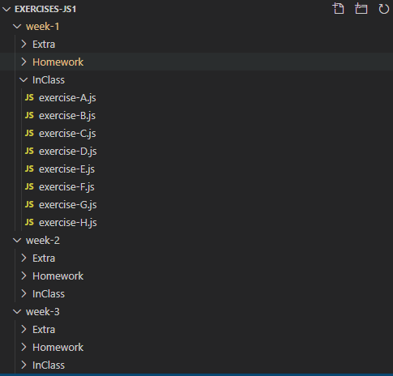

# Mentors Guide

# Index

- [Introduction](#introduction)
  - [Main instructors](#main-instructors)  
  - [Supporting instructors](#supporting-instructors)
- [General information](#general-information)
  - [Module Structure](#module-structure)  
  - [Example of a lesson structure](#example-of-a-lesson-structure)
  - [Exercises repositories in Github](#exercises-repositories-in-github)
  - [Tools that we use](#tools-that-we-use)
  - [Know your students](#know-your-students)
- [Feedback & Contributing](#feedback-&-contributing)
- [Other links](#other-links)

# Introduction

Basic information that **main instructors** should know:

## Main instructors

- Lessons structure
    - Check that you know the [module and lessons structure](#module-structure)
    - You know how to manage the [exercises repositories on Github](#exercises-repositories-in-github)
- Lessons contents and materials
    - You checked the [Notes and extra materials](mentors-weeks.html) for each lesson
    - You know what [tools are using the students](#tools-that-we-use)
    - Only for online classes, you read the [Online classes manual](https://docs.google.com/document/d/13KBKYSfzPxzGtEE5HM15M6vUOjSz71wgYNfx0SOGQQE/edit)

## Supporting instructors

Basic information that **supporting instructors** should know:

- Check that you know the [module and lessons structure](#module-structure)
- You know what [tools are using the students](#tools-that-we-use)
- Only for online classes, you read the [Online classes manual](https://docs.google.com/document/d/13KBKYSfzPxzGtEE5HM15M6vUOjSz71wgYNfx0SOGQQE/edit)

# General information

## Module Structure

Each module has 3 weeks lessons, and each lesson is divided as follows:
  - **Weekday (4h)**: explain topics through materials syllabus and presentations and coding, in every topic there are one or more exercises that you would give time to the students to do it, later you can show how to solve it
  - **Homework (20h)**: exercises students should complete between the Weekday and the Weekend to practice the new content. As a instructor you don't have to do anything, the Migracode's Education Team will help and push the students to have all exercises finished before the Weekend.
  - **Weekend (4h)**: is a day to practice, at the beginning we would do a recap and check together the homework, after it and with support, they have to do the exercises by their own. The instructor can stop the class to explain a common doubt or solve exercises together. But it is important to let them think and cope the exercises, to not always just copy what the mentor is writing.

## Example of a lesson structure

---

### [Class name]

** What we will learn today?**

* Topic 1
* Topic 2
* Topic 3

#### Topic 1

High level explanation of Topic 1 - rely on the exercises

> **Exercise A (10 min)**  _exercises students should do during the class_

#### Topic 2

> **Exercise B (10 min)**

#### Topic 3

> **Exercise C (10 min)**

### Resources

1. [Resource 1 to learn more about Topic 1](https://google.com)
2. [Resource 2 for Topic 2](https://google.com)

### Homework

_common tasks send as homework_

1. Review and finish all exercises in the folder week-1/InClass
2. Complete all of the exercises in the folder week-1/Homework
3. Push the changes to your repository in Github
4. Complete the Homework Form, to notify mentors and add comments and questions about the exercises

### Practice Day (Saturday)

_common tasks to do on Saturday_

1. Check together, solve doubts and fix the Homework exercises
2. List of exercises _depends on the week_
3. [Optional] Complete the exercises in the folder week-2/Extra
4. Push the changes to your repository in Github

---

## Exercises Repositories in Github

All the exercises students should complete during the class, as homework and on saturday, are all inside a GitHub repository that they fork and clone every module. The structure is as follows:

- For each week of the module we have a folder with the week number week-1
- Inside each week folder, we can find 3 folders:
    - InClass: exercises they should complete during the class
    - Homework: exercises they should complete after the class and before Saturday
    - Extra: optional exercises students can complete when they want
- See a [repository example](https://github.com/Migracode-Barcelona/exercises-js1)

## Tools that we use

As a mentor you can use the O.S. that you have, or you can use other tools not listed taking into account to not confuse students

- Ubuntu: most students have Ubuntu, but there are some students with Mac or Windows
- Visual Code: is the IDE we use for all the languages during the course
- Git: all the students have a GitHub account and push their exercises always using the Terminal
- Node: is the tool we use to execute by command line scripts without UI
- NPM: to install modules and to execute Web Servers
- Chrome: Browser we normally use, and we teach how to use the inspector
- PostreSQL
- DBeaver: as an SQL client with UI

## Know your students

To see the students progress ask for access in the files

- [Students Progress](https://docs.google.com/spreadsheets/d/1TKd_X-bsx1qbInkAv7x5d3slkJF9sEExfCnFRyjllBk)

# Feedback & Contributing

Under construction: for now any feedback or contribution is completely welcome, just email to carlos@migracode.org or send a Slack message
There are discussions about each module and every class in a module, make sure to go through them (or add a new issue/discussion point).

# Other links

- [Code of conduct](CODE_OF_CONDUCT.md)
- [Git Contributing](CONTRIBUTING.md)
